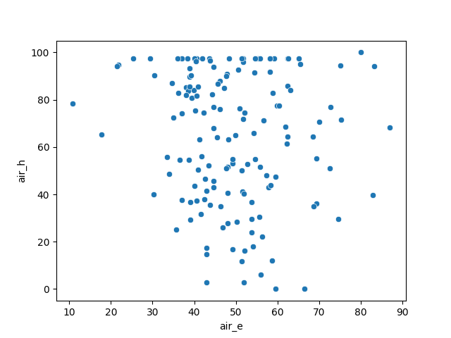
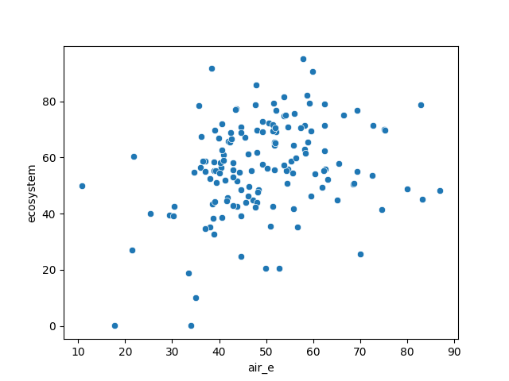
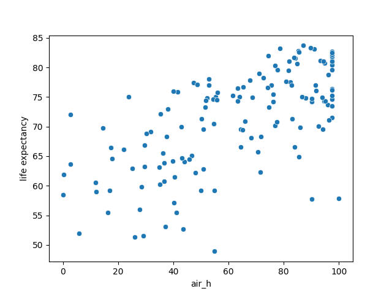

# environment-human

A Python pipeline to analyze predictors of life-expectancy using features from the `epi` dataset. Data is loaded in via `sql-alchemy` and transformed using `pandas`. Visualizations are generated via `seaborn` and `matplotlib` before data is loaded back into the `postgres` local databse.

## Results

  
Correlation between air affects on humans & air affects on environment is not visually obvious.

  
Similarly, there does not appear to be a trend associated with air_e and life expectancy

  
However, there is a positive correlation between air affect on human and life expectancy.

Looking at this trend further, we find an R2 value of `0.44` when creating a linear regressor using air_h as the independent variable, and life as the dependent. While this shows loose correlation, this could point to the need for further analysis through scaling or models with more predictive power.

## Next Actions

* Find granular data that describes disease from air quality
* Modularize code
* Explore different models for more predictive power
* Load data into Tableau visaulization